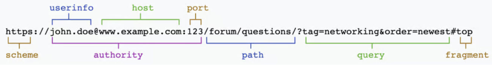

# RawURLParser

A Go package that parses URLs in their raw form.

- Preserves all characters exactly as provided
- No normalization of paths
- No encoding/decoding
- No validation

Unlike the standard library's url.Parse which uses Opaque for non-hierarchical URLs,
this package preserves the exact path encoding for all URLs. When using with http.Client,
the raw path should be assigned to URL.Opaque to prevent normalization.

## Features

- Preserves all characters exactly as provided
- No normalization of paths
- No encoding/decoding
- Raw preservation of special characters
- Simple and fast parsing
- Helper methods for port, hostname, and query parsing


# Understanding URL/URI 

URI (Uniform Resource Identifier), URL (Uniform Resource Locator), and URN (Uniform Resource Name) explained with examples. 

- A Uniform Resource Identifier (URI) is a string of characters that uniquely identify a name or a resource on the internet. A URI identifies a resource by name, location, or both. URIs have two specializations known as Uniform Resource Locator (URL), and Uniform Resource Name (URN).

-  A Uniform Resource Locator (URL) is a type of URI that specifies not only a resource, but how to reach it on the internet—like http://, ftp://, or mailto://.

- A Uniform Resource Name (URN) is a type of URI that uses the specific naming scheme of urn:—like urn:isbn:0-486-27557-4 or urn:isbn:0-395-36341-1.

- So a URI or URN is like your name, and a URL is a specific subtype of URI that’s like your name combined with your address. 

All URLs are URIs, but not all URIs are URLs.

## URL Structures


 - A URI is an identifier of a specific resource. Examples: Books, Documents

 - A URL is special type of identifier that also tells you how to access it. Examples: HTTP, FTP, MAILTO

- If the protocol (https, ftp, etc.) is either present or implied for a domain, you should call it a URL—even though it’s also a URI. 



 Schemes can include: HTTP, HTTPS, FTP, MAILTO, IRC, FILE, etc. HTTP and HTTPS are usually used to reach internet resources, but they can point to local (on-network or on-computer) resources as well.

The FILE scheme refers to a file located on the local computer, and it looks for the file at the path that’s provided. The host can also include a port designation that overrides the default port for the specified protocol

Credits: https://danielmiessler.com/p/difference-between-uri-url/

## Important Notice

### Go's http.Client and Raw URLs

RawURLParser does not return a net/url.URL structure by design. For maximum compatibility with raw URL paths and special characters, it is recommended to use a custom HTTP client that handles raw URL strings directly.

However, if you need to work with Go's standard http.Client, here are some workarounds to preserve raw paths:

#### Workaround 1: Using URL.Opaque 
```go
// Create new request
req, err := http.NewRequestWithContext(ctx, "GET", rawURL, nil)
if err != nil {
    return err
}

// Parse the raw URL
parsedURL, err := rawurlparser.RawURLParse(rawURL)
if err != nil {
    return err
}

// Set the Host header explicitly
req.Host = parsedURL.Host

// Set the entire URL as Opaque to prevent normalization
req.URL.Opaque = rawURL
```

> Note: This approach will send the full URL (including scheme://host) in the request path. While valid in HTTP/1.1, this is not recommended as some web servers might not handle it correctly.

> Also note that it might not be sufficient to just use core Go to create a new request, I recommend to create a helper function that will clone the HTTP request struct, set the basic stuff and then set the Raw URL string to the Opaque field.


#### Workaround 2: Using a Proxy (Better)
To avoid sending full URLs in the request path, another approach is to proxy these requests through a local proxy that will:
1. Receive the full URL in the path
2. Extract just the path component
3. Forward the request with the correct raw path

```go
// Example proxy configuration
// use url.Parse only to parse the proxy URL, not the target/input URL.
proxyURL, _ := url.Parse("http://localhost:8080")
client := &http.Client{
    Transport: &http.Transport{
        Proxy: http.ProxyURL(proxyURL),
    },
}


// now add the rest of the code from workaround 1
```


### Recommended Approach
The recommended approach is to use a custom HTTP client that:
- Builds raw HTTP requests from scratch
- Sends them without any normalization or encoding
- Preserves exact path formatting

Tips and examples for building such a client will be documented in this repository.

## Installation

```bash
go get github.com/slicingmelon/go-rawurlparser
```

## Usage

```go
package main

import (
    "fmt"
    "github.com/slicingmelon/go-rawurlparser"
)

func main() {
    url := "https://example.com/path1/..%2f/test?q=1#fragment"
    parsedUrl, err := rawurlparser.RawURLParse(url)
    if err != nil {
        log.Errorf("Invalid URL: %s", err)
    }
    
    fmt.Printf("Scheme:   %s\n", parsedUrl.Scheme)
    fmt.Printf("Host:     %s\n", parsedUrl.Host)
    fmt.Printf("Port:     %s\n", parsedUrl.Port)
    fmt.Printf("Path:     %s\n", parsedUrl.Path)
    fmt.Printf("Query:    %s\n", parsedUrl.Query)
    fmt.Printf("Fragment: %s\n", parsedUrl.Fragment)
}
```

## Helper Methods

The pkg provides several helper methods:

Check go docs to see the functions.

## Error Handling

I don't particularly like errors. 


## Tests

```bash
go run .\examples\main.go

Testing URL: https://example.com/x/。。;//
----------------------------------------
url.Parse:
Full URL: https://example.com/x/%E3%80%82%E3%80%82;//
Path: /x/。。;//
RawPath: /x/。。;//

rawurlparser.RawURLParse:
Full URL: https://example.com/x/。。;//
Path: /x/。。;//

## Closer URLs Comparison ##
Standard UrlParser: https://example.com/x/%E3%80%82%E3%80%82;//
RawUrlPaser:      https://example.com/x/。。;//

========================================

Testing URL: https://example.com/x/。。;//
----------------------------------------
url.Parse:
Full URL: https://example.com/x/%E3%80%82%E3%80%82;//
Path: /x/。。;//
RawPath: /x/。。;//

rawurlparser.RawURLParse:
Full URL: https://example.com/x/。。;//
Path: /x/。。;//

## Closer URLs Comparison ##
Standard UrlParser: https://example.com/x/%E3%80%82%E3%80%82;//
RawUrlPaser:      https://example.com/x/。。;//

========================================

Testing URL: https://example.com\..\.\
----------------------------------------
url.Parse error: parse "https://example.com\\..\\.\\": invalid character "\\" in host name

rawurlparser.RawURLParse:
Full URL: https://example.com\..\.\
Path:
========================================

Testing URL: https://example.com#
----------------------------------------
url.Parse:
Full URL: https://example.com
Path:
RawPath:

rawurlparser.RawURLParse:
Full URL: https://example.com#
Path:

## Closer URLs Comparison ##
Standard UrlParser: https://example.com
RawUrlPaser:      https://example.com#
```

## Author

Petru Surugiu<br>
https://twitter.com/pedro_infosec

## License

MIT License